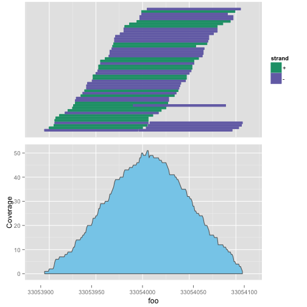
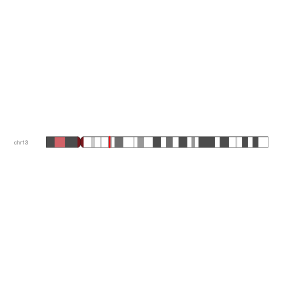

<!-- R Markdown Documentation, DO NOT EDIT THE PLAIN MARKDOWN VERSION OF THIS FILE -->

<!-- Copyright 2014 Google Inc. All rights reserved. -->

<!-- Licensed under the Apache License, Version 2.0 (the "License"); -->
<!-- you may not use this file except in compliance with the License. -->
<!-- You may obtain a copy of the License at -->

<!--     http://www.apache.org/licenses/LICENSE-2.0 -->

<!-- Unless required by applicable law or agreed to in writing, software -->
<!-- distributed under the License is distributed on an "AS IS" BASIS, -->
<!-- WITHOUT WARRANTIES OR CONDITIONS OF ANY KIND, either express or implied. -->
<!-- See the License for the specific language governing permissions and -->
<!-- limitations under the License. -->

Plotting Alignments
-------------------

Let's take a look at the reads that overlap rs9536314 for sample NA12893 within the [Illumina Platinum Genomes](https://cloud.google.com/genomics/data/platinum-genomes) dataset.

```r
require(GoogleGenomics)
reads <- getReads(readsetId="CMvnhpKTFhDyy__v0qfPpkw",
                  chromosome="chr13",
                  start=33053995,
                  end=33054010)
```

```
## Fetching reads page
## Reads are now available
```

```r
alignments <- readsToGAlignments(reads)
```

Display the basic alignments and coverage data:

```r
require(ggplot2)
require(ggbio)
alignmentPlot <- autoplot(alignments, aes(color=strand, fill=strand))
```

```
## Scale for 'colour' is already present. Adding another scale for 'colour', which will replace the existing scale.
## Scale for 'fill' is already present. Adding another scale for 'fill', which will replace the existing scale.
```

```r
coveragePlot <- ggplot(as(alignments, 'GRanges')) + stat_coverage(color="gray40", fill="skyblue")
tracks(alignmentPlot, coveragePlot, xlab="foo")
```

 

You could also display the spot on the chromosome these alignments came from:

```r
ideogramPlot <- plotIdeogram(genome="hg19", subchr="chr13")
ideogramPlot + xlim(as(alignments, 'GRanges'))
```

 

### Provenance
Package versions used:

```r
sessionInfo()
```

```
## R version 3.1.1 (2014-07-10)
## Platform: x86_64-apple-darwin13.1.0 (64-bit)
## 
## locale:
## [1] en_US.UTF-8/en_US.UTF-8/en_US.UTF-8/C/en_US.UTF-8/en_US.UTF-8
## 
## attached base packages:
## [1] stats4    parallel  stats     graphics  grDevices utils     datasets 
## [8] methods   base     
## 
## other attached packages:
##  [1] org.Hs.eg.db_3.0.0                     
##  [2] RSQLite_0.11.4                         
##  [3] DBI_0.3.1                              
##  [4] BSgenome.Hsapiens.UCSC.hg19_1.3.99     
##  [5] BSgenome_1.34.0                        
##  [6] rtracklayer_1.26.1                     
##  [7] TxDb.Hsapiens.UCSC.hg19.knownGene_3.0.0
##  [8] GenomicFeatures_1.18.1                 
##  [9] AnnotationDbi_1.28.0                   
## [10] Biobase_2.26.0                         
## [11] ggbio_1.14.0                           
## [12] ggplot2_1.0.0                          
## [13] knitr_1.7                              
## [14] testthat_0.9.1                         
## [15] GoogleGenomics_0.1.1                   
## [16] VariantAnnotation_1.12.1               
## [17] GenomicAlignments_1.2.0                
## [18] Rsamtools_1.18.0                       
## [19] Biostrings_2.34.0                      
## [20] XVector_0.6.0                          
## [21] GenomicRanges_1.18.1                   
## [22] GenomeInfoDb_1.2.0                     
## [23] IRanges_2.0.0                          
## [24] S4Vectors_0.4.0                        
## [25] BiocGenerics_0.12.0                    
## [26] BiocInstaller_1.16.0                   
## 
## loaded via a namespace (and not attached):
##  [1] acepack_1.3-3.3     base64enc_0.1-2     BatchJobs_1.4      
##  [4] BBmisc_1.7          BiocParallel_1.0.0  biomaRt_2.22.0     
##  [7] biovizBase_1.14.0   bitops_1.0-6        brew_1.0-6         
## [10] checkmate_1.5.0     cluster_1.15.3      codetools_0.2-9    
## [13] colorspace_1.2-4    dichromat_2.0-0     digest_0.6.4       
## [16] evaluate_0.5.5      fail_1.2            foreach_1.4.2      
## [19] foreign_0.8-61      formatR_1.0         Formula_1.1-2      
## [22] GGally_0.4.8        graph_1.44.0        grid_3.1.1         
## [25] gridExtra_0.9.1     gtable_0.1.2        Hmisc_3.14-5       
## [28] httr_0.5            iterators_1.0.7     jsonlite_0.9.13    
## [31] labeling_0.3        lattice_0.20-29     latticeExtra_0.6-26
## [34] MASS_7.3-35         munsell_0.4.2       nnet_7.3-8         
## [37] OrganismDbi_1.8.0   plyr_1.8.1          proto_0.3-10       
## [40] RBGL_1.42.0         RColorBrewer_1.0-5  Rcpp_0.11.3        
## [43] RCurl_1.95-4.3      reshape_0.8.5       reshape2_1.4       
## [46] rjson_0.2.14        rpart_4.1-8         scales_0.2.4       
## [49] sendmailR_1.2-1     splines_3.1.1       stringr_0.6.2      
## [52] survival_2.37-7     tools_3.1.1         XML_3.98-1.1       
## [55] zlibbioc_1.12.0
```
